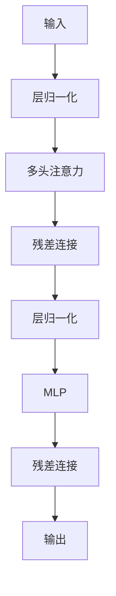

# Vision Transformer (ViT) 实现详解

## 概述
本项目实现了 Vision Transformer (ViT) 模型，这是一种将自然语言处理领域的Transformer架构应用于计算机视觉任务的创新方法。ViT通过将图像分割为小块(patch)序列进行处理，完全取代了传统CNN在图像识别中的主导地位。

## 模型架构

### 整体流程


### 输入输出形状
| 阶段 | 输入形状 | 输出形状 | 说明 |
|------|----------|----------|------|
| **输入图像** | (B, 3, 224, 224) | (B, 3, 224, 224) | B为批次大小 |
| **Patch Embedding** | (B, 3, 224, 224) | (B, 196, 768) | 将图像分割为14×14=196个16×16的patch |
| **添加CLS Token** | (B, 196, 768) | (B, 197, 768) | 添加分类标记 |
| **位置编码** | (B, 197, 768) | (B, 197, 768) | 加入空间位置信息 |
| **Transformer编码器** | (B, 197, 768) | (B, 197, 768) | 12层编码器处理 |
| **提取CLS特征** | (B, 197, 768) | (B, 768) | 仅取CLS token特征 |
| **分类头** | (B, 768) | (B, num_classes) | 最终分类输出 |

## 核心组件详解

### 1. Patch Embedding
**数学原理**：  
$X_{\text{patch}} = \text{Conv2d}(X_{\text{img}})$  
其中卷积核大小=步长=patch大小

**功能**：
- 将图像分割为N×N的patch
- 每个patch展平后通过线性投影到D维空间
- 添加Layer Normalization

**实现**：
```python
class PatchEmbedding(nn.Module):
    def __init__(self, img_size, in_channels, patchsize, embed_dim, normlayer=None):
        self.proj = nn.Conv2d(in_channels, embed_dim, kernel_size=patchsize, stride=patchsize)
        self.norm = normlayer(embed_dim) if normlayer else nn.Identity()
    
    def forward(self, x):
        x = self.proj(x).flatten(2).transpose(1, 2)
        return self.norm(x)
```

### 2. 位置编码
**数学原理**：  
$PE_{(pos,2i)} = \sin\left(\frac{pos}{10000^{2i/d_{\text{model}}}}\right)$  
$PE_{(pos,2i+1)} = \cos\left(\frac{pos}{10000^{2i/d_{\text{model}}}}\right)$

**功能**：
- 为每个patch添加位置信息
- 使用正弦/余弦函数生成固定位置编码

**实现**：
```python
class PositionalEncoding(nn.Module):
    def __init__(self, embed_dim, max_len=5000):
        pe = torch.zeros(max_len, embed_dim)
        position = torch.arange(0, max_len).unsqueeze(1)
        div_term = torch.exp(torch.arange(0, embed_dim, 2) * -(math.log(10000.0) / embed_dim))
        pe[:, 0::2] = torch.sin(position * div_term)
        pe[:, 1::2] = torch.cos(position * div_term)
        self.register_buffer('pe', pe.unsqueeze(0))
```

### 3. 多头注意力机制
**数学原理**：  
$\text{Attention}(Q,K,V) = \text{softmax}\left(\frac{QK^T}{\sqrt{d_k}}\right)V$  
其中 $Q = XW_q$, $K = XW_k$, $V = XW_v$

**功能**：
- 将输入拆分为多个头并行计算注意力
- 缩放点积注意力机制
- 残差连接和层归一化

**实现**：
```python
class MultiHeadAttention(nn.Module):
    def __init__(self, embed_dim, num_heads=8, dropout=0.1):
        self.head_dim = embed_dim // num_heads
        self.qkv_proj = nn.Linear(embed_dim, embed_dim * 3)
        self.out_proj = nn.Linear(embed_dim, embed_dim)
    
    def forward(self, x):
        qkv = self.qkv_proj(x).view(batch_size, seq_len, 3, num_heads, head_dim)
        query, key, value = qkv.unbind(2)
        attn_output = attention(query, key, value)
        return self.out_proj(attn_output)
```

### 4. Transformer编码器层
**结构**：


**实现**：
```python
class EncoderLayer(nn.Module):
    def __init__(self, embed_dim, num_heads, mlp_ratio=4):
        self.attn = MultiHeadAttention(embed_dim, num_heads)
        self.mlp = MLP(embed_dim, int(embed_dim * mlp_ratio))
        self.sublayer = clones(SublayerConnection(embed_dim), 2)
    
    def forward(self, x):
        x = self.sublayer[0](x, lambda x: self.attn(x))
        return self.sublayer[1](x, self.mlp)
```

## 训练流程

### 数据处理
1. 图像预处理：
   - 训练集：随机裁剪(224×224) + 水平翻转
   - 验证集：中心裁剪(224×224)
   - 归一化：`transforms.Normalize([0.5,0.5,0.5], [0.5,0.5,0.5])`

2. 数据集分割：
   - 按类别自动划分训练集/验证集
   - 默认验证集比例：20%

### 优化策略
- 优化器：SGD with momentum (0.9)
- 学习率调度：余弦退火
  $lr = \eta_{\min} + \frac{1}{2}(\eta_{\max} - \eta_{\min})(1 + \cos(\frac{T_{\text{cur}}}{T_{\max}}\pi))$
- 权重衰减：5e-5

### 训练技巧
1. **迁移学习**：
   - 使用预训练权重初始化
   - 冻结除分类头外的所有层
   
2. **正则化**：
   - Dropout (默认0.1)
   - DropPath (随机深度正则化)

## 使用示例
```python
# 初始化模型
model = ViT(
    img_size=224,
    patchsize=16,
    in_channels=3,
    num_classes=1000,
    embed_dim=768,
    depth=12,
    num_heads=12
)

# 训练配置
trainer = MyTrainer(
    num_classes=5,
    epochs=10,
    batch_size=32,
    lr=0.001,
    data_path='/path/to/dataset'
)

# 开始训练
trainer.train()
```

## 性能指标
训练过程中监控以下指标：
- 训练/验证损失
- 训练/验证准确率
- 学习率变化
- 类别分布

## 参考文献
- Dosovitskiy, A., et al. (2020). "An Image is Worth 16x16 Words: Transformers for Image Recognition at Scale". arXiv:2010.11929
- Vaswani, A., et al. (2017). "Attention Is All You Need". NeurIPS
